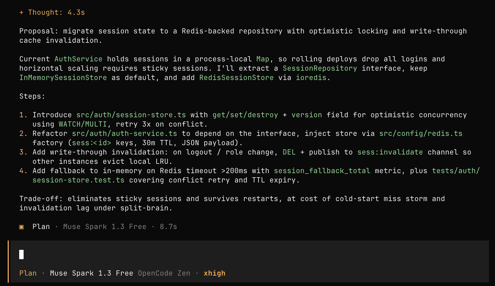
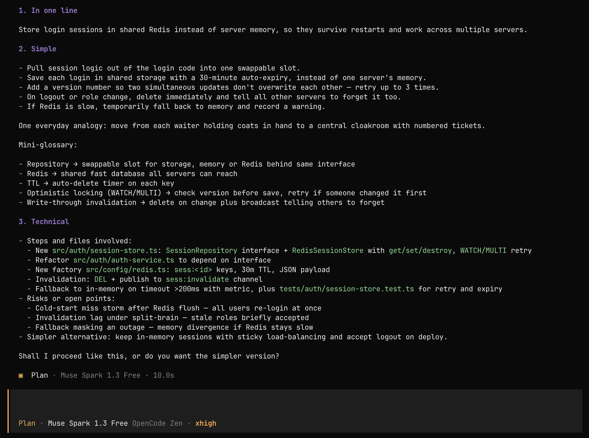
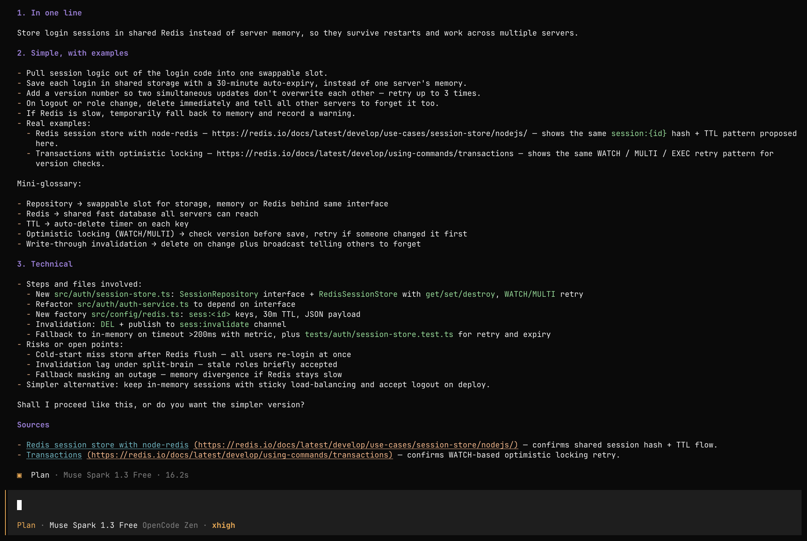

<div align="center">
<pre>
      ___                                     ___     
     /\  \         _____                     /\  \    
    _\:\  \       /::\  \         ___       |::\  \   
   /\ \:\  \     /:/\:\  \       /|  |      |:|:\  \  
  _\:\ \:\  \   /:/  \:\__\     |:|  |    __|:|\:\  \ 
 /\ \:\ \:\__\ /:/__/ \:|__|    |:|  |   /::::|_\:\__\
 \:\ \:\/:/  / \:\  \ /:/  /  __|:|__|   \:\~~\  \/__/
  \:\ \::/  /   \:\  /:/  /  /::::\  \    \:\  \      
   \:\/:/  /     \:\/:/  /   ~~~~\:\  \    \:\  \     
    \::/  /       \::/  /         \:\__\    \:\__\    
     \/__/         \/__/           \/__/     \/__/    

</pre>
</div>

<h1 align="center">What do you mean</h1>

<p align="center">
  <em>Your agent just proposed something complex. Understand it first.</em>
</p>

<p align="center">
  
  
</p>

## Table of Contents

- [How it works](#how-it-works)
- [Before and after](#before-and-after)
- [Commands](#commands)
- [Install](#install)
  - [OpenCode](#opencode)
  - [Claude Code](#claude-code)
- [Usage](#usage)
- [Layout](#layout)
- [Related work](#related-work)
- [FAQ](#faq)
- [License](#license)

## How it works

Coding agents sometimes answer with a complex plan — new files, patterns you
have never used, trade-offs you cannot judge yet. Instead of approving blindly
or pasting the plan into another chat, type `/wdym`. WDYM explains that same
plan in plain words, on three levels, and only then asks whether to proceed.
Nothing is implemented, nothing is modified. Understanding comes first.

## Before and after

Your agent proposes: *"migrate session state to a Redis-backed repository with
optimistic locking and write-through cache invalidation."* You type:

```text
/wdym
```

You get:

```text
## 1. In one line
Store login sessions in Redis instead of memory, so they survive restarts.

## 2. Simple
- ...5 plain-word steps, one everyday analogy, mini-glossary...

## 3. Technical
- ...steps, files, risks, simpler alternative...

Shall I proceed like this, or do you want the simpler version?
```

Need proof it works elsewhere? `/wdym-example` adds 1–2 real online cases with links.

**Plan**


**/wdym**


**/wdym-example**


## Commands

| Command | What it does |
|---------|--------------|
| `/wdym [text]` | Explain the last answer/plan in simple terms (3 levels). |
| `/wdym-example [text]` | Same, grounded with real online examples and links. |

Without arguments both explain the last answer in the session. Language follows
yours (English default). Explanation only — never implements.

## Install

### OpenCode

From git:

```json
{ "plugin": ["opencode-wdym@git+https://github.com/filippostanghellini/What-do-you-mean.git"] }
```

From a local checkout (path relative to the `opencode.json` declaring it;
use an absolute path when declaring from the global config):

```json
{ "plugin": ["./.opencode/plugins/wdym.mjs"] }
```

Then restart OpenCode. Verify: type `/wdym` or ask "what do you mean?".

Details: `.opencode/INSTALL.md`.

### Claude Code

From the marketplace:

```text
/plugin marketplace add filippostanghellini/What-do-you-mean
/plugin install wdym@wdym-marketplace
```

`commands/` and `skills/` are picked up by convention (no manifest listing needed).

Plugin commands are namespaced, so invoke them as:

```text
/wdym:wdym
/wdym:wdym-example
```

Note: `commands/wdym.md` and `skills/wdym/` share the same names on purpose
(`commands/` feeds the opencode `/wdym` command). On Claude Code same-named
entries collapse into one (`/wdym:wdym`) — same content by construction, so
nothing is lost.

## Usage

```text
/wdym
/wdym explain the plan above in your own words
/wdym-example
/wdym-example show me real projects using this pattern
```

`websearch` in OpenCode needs the OpenCode/Go provider or
`OPENCODE_ENABLE_EXA=1` / `OPENCODE_ENABLE_PARALLEL=1` (pinnable via
`websearch.provider` / `OPENCODE_WEBSEARCH_PROVIDER`); otherwise
`/wdym-example` falls back to `webfetch` or labeled model knowledge.
Companion plugins like `opencode-websearch` also work.

## FAQ

**Does it write code?**
No. It only explains. Implementation stays yours (or your agent's, after you say go).

**Which language does it answer in?**
Yours. English if ambiguous.

**Why not just use ELI5?**
ELI5 explains anything to anyone; WDYM explains *this plan, right now*,
including files, risks, and a simpler alternative — plus real links with
`/wdym-example`.
